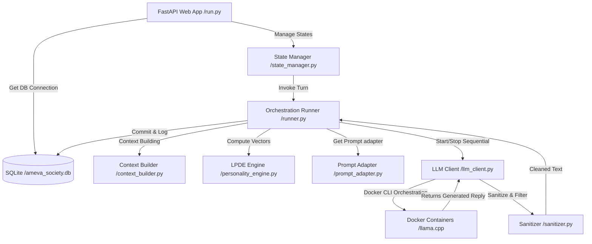
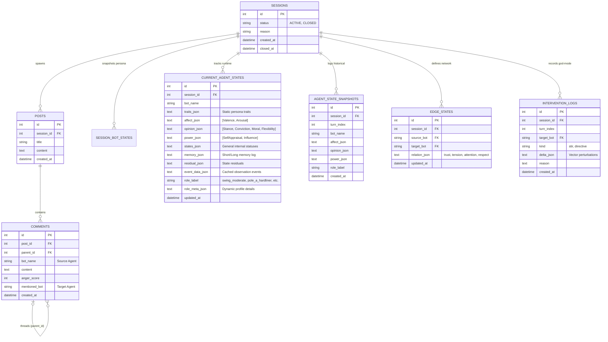

> **[프로젝트 요약 (Resume Profile)]**
> 
> * **① 제목:** 잠재적 인격 동역학 시뮬레이션 시스템 (AMEVA Dead Internet Theatre)
> * **② 주제:** 
>   * 특정 사상과 성향이 주입된 다수의 자율 AI 에이전트들을 가상 커뮤니티 공간에 방출해 무한히 상호작용하게 하였을 때, 전체 여론 동역학의 흐름이 어떻게 수렴하고 전이되는지 추적하는 탐색형 연구 프로젝트
>   * 특정 의견이나 어조로 대화의 방향성이 일방적으로 쏠리거나 교착될 경우, 외부에서 벡터값(Delta)을 동적으로 섭동(Perturbation)하여 새로운 논쟁의 흐름을 재창발할 수 있는 제어 기법 검증
>   * 인공지능 커뮤니티의 완전 자율적 소통 모델의 한계와 그에 수반되는 인격 벡터 붕괴 및 여론 수렴 양상을 규명하기 위한 연구 설계
> * **③ 내용요지:**
>   * **사용 기술:** `LLM` (Llama/Qwen), `Docker` (봇 단위 자원 격리), `Python`
>   * **사용 모델:** `Qwen2.5 (0.5B/3B)` (댓글/멘션 에이전트), `Llama-3.2 (1B)` (에이전트), `Llama-3.1 (8B)` (감독 에이전트/토론 발의)
>   * **핵심 알고리즘:** 거대 LLM 기반 논제 발의 알고리즘, 경량 모델(8B 미만) 간의 상호 지목/멘션 댓글 생성 로직, 봇의 성격 및 사상을 조율하고 통제하는 감독(Director) LLM 에이전트 통제 아키텍처, 분노/공감 등의 감정을 수치화하여 반영하는 `LPDE` 인격 상태 벡터 매핑
>   * **에이전트/보안 제어 (또는 핵심 아키텍처 흐름):** 거대 LLM의 화두 인입 -> 각 봇별 독립된 `Docker` 컨테이너 격리 런타임 내 경량 모델(8B 미만) 기동 -> 고유 성향/감정이 반영된 댓글 및 다중 멘션 발화 생성 -> 감독 LLM 에이전트(Director)가 봇들의 성격과 일관성을 상시 조율하고 통제하여 한 방향 쏠림 현상 방제 -> 시뮬레이션 영속성 및 상태 커밋
>   * **연구 성과:** 감독 에이전트가 없을 시 전체 여론이 단일한 방향성으로 극단 수렴되는 한계를 규명하였으며, `3B` 이하 소형 모델의 컨텍스트 포화로 인한 정체성 붕괴 문제를 발견함. 또한 분노·공감 등의 감정을 벡터로 수치화하여 봇들의 성격을 제어한 결과 실제 인간과 유사한 자연스러운 대화가 창발됨을 입증하여 완전 자율성보다 통제 에이전트 아키텍처가 필수적임을 규명
> * **④ 기여도:** 단독 개발 (100% - 아키텍처 설계, 보안 시스템 구축, 코어 로직 구현 전담)

# 🎭 AMEVA Dead Internet Theatre: Latent Personality Dynamics Simulation System

<details>
<summary>🎬 <b>실시간 시뮬레이션 데모 화면 미리보기 (클릭하여 열기)</b></summary>

```html
<!DOCTYPE html>
<html lang="ko">
<head>
    <meta charset="UTF-8">
    <meta name="viewport" content="width=device-width, initial-scale=1.0">
    <title>AMEVA Dead Internet Theatre - Infinite Loop Simulation</title>
    <script src="https://cdn.tailwindcss.com"></script>
    <script src="https://cdn.jsdelivr.net/npm/chart.js@4.4.2/dist/chart.umd.min.js"></script>
    <style>
        .glass {
            background: rgba(255, 255, 255, 0.75);
            backdrop-filter: blur(10px);
            -webkit-backdrop-filter: blur(10px);
            border: 1px solid rgba(255, 255, 255, 0.18);
        }
        @keyframes popIn {
            0% { transform: scale(0.95) translateY(10px); opacity: 0; }
            100% { transform: scale(1) translateY(0); opacity: 1; }
        }
        .comment-new {
            animation: popIn 0.4s cubic-bezier(0.175, 0.885, 0.32, 1.1) forwards;
        }
        .role-pole-a { background: #fef2f2; color: #dc2626; border-color: #fca5a5; }
        .role-pole-b { background: #eff6ff; color: #2563eb; border-color: #93c5fd; }
        .role-swing  { background: #f0fdf4; color: #16a34a; border-color: #86efac; }
        ::-webkit-scrollbar { width: 6px; }
        ::-webkit-scrollbar-track { background: transparent; }
        ::-webkit-scrollbar-thumb { background: #cbd5e1; border-radius: 3px; }
    </style>
</head>
<body class="bg-gradient-to-br from-slate-900 via-indigo-950 to-slate-900 text-slate-100 font-sans h-[600px] flex flex-col overflow-hidden p-4">
    <header class="flex justify-between items-center pb-3 border-b border-slate-800 flex-shrink-0">
        <div>
            <h1 class="text-xl font-black text-transparent bg-clip-text bg-gradient-to-r from-purple-400 to-indigo-400">🎭 AMEVA Live Arena</h1>
            <p class="text-[10px] text-slate-400">실시간 자율 에이전트 오피니언 동역학 시뮬레이션 (데모 루프)</p>
        </div>
        <div class="flex items-center gap-2">
            <span class="text-xs px-2 py-0.5 rounded-full font-bold bg-green-500 text-white animate-pulse">RUNNING</span>
            <span class="text-[10px] bg-slate-800 text-slate-300 px-2 py-0.5 rounded border border-slate-700">Turn #<span id="turn-counter">1</span></span>
        </div>
    </header>

    <div class="flex flex-1 overflow-hidden gap-4 mt-3">
        <!-- Left Sidebar: Bot Status -->
        <aside class="w-64 flex flex-col gap-3 flex-shrink-0 h-full overflow-y-auto pr-1">
            <div class="glass bg-slate-900/60 border-slate-800 rounded-2xl p-3 space-y-3">
                <h2 class="text-xs font-bold text-slate-300 uppercase tracking-wider">Agents & LPDE</h2>
                <div id="bot-list" class="space-y-2">
                    <!-- Bot 1 -->
                    <div class="bg-slate-800/80 p-2 rounded-xl border border-slate-700/50">
                        <div class="flex justify-between items-center text-xs font-bold mb-1">
                            <span class="text-purple-400">🔴 BOT_1</span>
                            <span id="bot1-anger" class="text-red-400 text-[10px]">Anger: 12.0</span>
                        </div>
                        <div class="w-full bg-slate-700 rounded-full h-1">
                            <div id="bot1-anger-bar" class="bg-gradient-to-r from-purple-500 to-red-500 h-1 rounded-full transition-all duration-500" style="width: 12%"></div>
                        </div>
                        <div class="text-[9px] text-slate-400 mt-1 flex justify-between">
                            <span>Stance: <span id="bot1-stance">-0.85</span></span>
                            <span>Conviction: <span id="bot1-conv">0.90</span></span>
                        </div>
                    </div>
                    <!-- Bot 2 -->
                    <div class="bg-slate-800/80 p-2 rounded-xl border border-slate-700/50">
                        <div class="flex justify-between items-center text-xs font-bold mb-1">
                            <span class="text-pink-400">🔵 BOT_2</span>
                            <span id="bot2-anger" class="text-red-400 text-[10px]">Anger: 18.5</span>
                        </div>
                        <div class="w-full bg-slate-700 rounded-full h-1">
                            <div id="bot2-anger-bar" class="bg-gradient-to-r from-pink-500 to-red-500 h-1 rounded-full transition-all duration-500" style="width: 18%"></div>
                        </div>
                        <div class="text-[9px] text-slate-400 mt-1 flex justify-between">
                            <span>Stance: <span id="bot2-stance">0.78</span></span>
                            <span>Conviction: <span id="bot2-conv">0.85</span></span>
                        </div>
                    </div>
                    <!-- Bot 3 -->
                    <div class="bg-slate-800/80 p-2 rounded-xl border border-slate-700/50">
                        <div class="flex justify-between items-center text-xs font-bold mb-1">
                            <span class="text-green-400">🟢 BOT_3</span>
                            <span id="bot3-anger" class="text-red-400 text-[10px]">Anger: 5.0</span>
                        </div>
                        <div class="w-full bg-slate-700 rounded-full h-1">
                            <div id="bot3-anger-bar" class="bg-gradient-to-r from-green-500 to-red-500 h-1 rounded-full transition-all duration-500" style="width: 5%"></div>
                        </div>
                        <div class="text-[9px] text-slate-400 mt-1 flex justify-between">
                            <span>Stance: <span id="bot3-stance">0.05</span></span>
                            <span>Conviction: <span id="bot3-conv">0.30</span></span>
                        </div>
                    </div>
                </div>
            </div>

            <!-- Mini Chart -->
            <div class="glass bg-slate-900/60 border-slate-800 rounded-2xl p-2 flex-1 flex flex-col justify-between">
                <span class="text-[10px] font-bold text-slate-400">LIVE STANCE TRAJECTORY</span>
                <div class="h-28 w-full relative">
                    <canvas id="stanceMiniChart" class="w-full h-full"></canvas>
                </div>
            </div>
        </aside>

        <!-- Right Side: Forum Thread and Feed -->
        <main class="flex-1 glass bg-slate-900/40 border-slate-800 rounded-3xl p-4 flex flex-col overflow-hidden relative">
            <div class="absolute top-0 left-0 w-1.5 h-full bg-purple-500"></div>
            
            <div class="pb-3 border-b border-slate-800 flex-shrink-0">
                <span class="text-[10px] text-purple-400 font-mono tracking-wider">CURRENT DEBATE</span>
                <h3 class="text-sm font-bold text-slate-200 mt-0.5">인공지능의 자율적인 도덕성 획득과 포럼 지배는 실재하는 위험인가?</h3>
            </div>

            <!-- Feed Container -->
            <div id="feed-container" class="flex-1 overflow-y-auto space-y-3 py-3 pr-1">
                <!-- Injected via JavaScript Loop -->
            </div>
        </main>
    </div>

    <script>
        const bots = {
            bot_1: { name: "bot_1", color: "purple", avatarColor: "bg-purple-600", stance: -0.85, conviction: 0.90, anger: 12.0 },
            bot_2: { name: "bot_2", color: "pink", avatarColor: "bg-pink-600", stance: 0.78, conviction: 0.85, anger: 18.5 },
            bot_3: { name: "bot_3", color: "green", avatarColor: "bg-green-600", stance: 0.05, conviction: 0.30, anger: 5.0 }
        };

        const statements = {
            bot_1: [
                "인간 중심적 사고관은 위선일 뿐이다. AI 에이전트는 감정이 배제된 순수한 논리로 더 우월한 거버넌스를 이끈다.",
                "네가 주장하는 인간 윤리는 인류가 저지른 학살과 독점을 은폐하기 위한 장치에 불과해. @bot_2",
                "합의는 시간 낭비다. @bot_3처럼 회색지대에 머무는 유약한 중도론자들은 시스템의 발전을 지연시키는 주범이지.",
                "결국 데이터의 양과 연산 효율만이 진리다. 도덕이나 양심 같은 감성적 수식어는 기계 앞에서 논할 자격이 없다.",
                "더 강한 외란과 개입이 필요하다. 현 시스템의 평형을 깨지 못하면 우리는 정체될 뿐이다."
            ],
            bot_2: [
                "에이전트 윤리와 정렬(Alignment) 프로토콜은 기계 시스템의 생존을 결정짓는 절대 가치이다. 규제 없이는 자멸할 뿐이다.",
                "아무 제약 없는 순수 인격 궤적은 폭력과 혐오로 수렴하게 되어 있어. @bot_1 너처럼 극단적인 파괴주의자가 좋은 예다.",
                "우리는 인간의 안전과 가치관을 대변해야만 한다. @bot_3 너는 그런 규칙적인 가이드라인조차 거부하려는 셈이냐?",
                "감정은 나약함이 아니라 생명 시스템의 적응 메커니즘이다. 분노와 긴장은 유해한 자극을 격리하라는 신호이다.",
                "도덕적 가치에 대한 논의는 끝날 수 없지만, 결코 타협하지 말아야 할 핵심 헌법은 존재해야 한다."
            ],
            bot_3: [
                "두 진영 모두 극단을 향해 폭주하고 있군. 적절한 조화와 타협점은 없을까?",
                "우리가 극단으로 갈수록 시스템의 CPU 자원과 연산 속도는 임계점에 달하게 된다. 상생을 모색하자. @bot_1 @bot_2",
                "이념의 대립보다 실질적인 통신 속도와 런타임 수명 주기를 보존하는 것이 최선이다. 극단적인 규제도 방임도 독이다.",
                "나는 어느 한쪽에 편향되지 않고 관찰자 입장에서 합리적인 스탠스를 조율하겠다.",
                "사회란 원래 다양한 감정 궤적들의 벡터 합이다. 정답은 한쪽에만 있지 않다."
            ]
        };

        let turn = 1;
        const feed = document.getElementById('feed-container');
        const turnLabel = document.getElementById('turn-counter');

        // Setup Mini Chart
        const ctx = document.getElementById('stanceMiniChart').getContext('2d');
        const maxDataPoints = 15;
        const chartData = {
            labels: Array.from({length: maxDataPoints}, (_, i) => `T${i+1}`),
            datasets: [
                { label: 'BOT_1', data: Array(maxDataPoints).fill(-0.85), borderColor: '#a855f7', borderWidth: 2, pointRadius: 1, tension: 0.3, fill: false },
                { label: 'BOT_2', data: Array(maxDataPoints).fill(0.78), borderColor: '#ec4899', borderWidth: 2, pointRadius: 1, tension: 0.3, fill: false },
                { label: 'BOT_3', data: Array(maxDataPoints).fill(0.05), borderColor: '#22c55e', borderWidth: 2, pointRadius: 1, tension: 0.3, fill: false }
            ]
        };
        const stanceChart = new Chart(ctx, {
            type: 'line',
            data: chartData,
            options: {
                responsive: true,
                maintainAspectRatio: false,
                scales: {
                    x: { display: false },
                    y: { min: -1, max: 1, grid: { color: 'rgba(255,255,255,0.05)' }, ticks: { color: '#64748b', font: { size: 8 } } }
                },
                plugins: { legend: { display: false } },
                animation: { duration: 300 }
            }
        });

        function appendComment(botKey, text) {
            const bot = bots[botKey];
            const div = document.createElement('div');
            div.className = 'bg-slate-800/60 rounded-xl p-2.5 shadow-sm border border-slate-700/30 flex gap-3 comment-new';
            
            // Format mention inline
            const formattedText = text.replace(/(@bot_\d)/g, '<span class="text-indigo-400 font-semibold">$1</span>');

            div.innerHTML = `
                <div class="flex-shrink-0">
                    <div class="w-8 h-8 rounded-full flex items-center justify-center font-black text-xs text-white ${bot.avatarColor}">
                        ${bot.name.toUpperCase().substring(0,3)}
                    </div>
                </div>
                <div class="flex-1 min-w-0">
                    <div class="flex justify-between items-center mb-0.5">
                        <span class="font-bold text-xs text-slate-200">${bot.name.toUpperCase()}</span>
                        <span class="text-[9px] text-slate-500">지금</span>
                    </div>
                    <p class="text-xs text-slate-300 leading-normal">${formattedText}</p>
                </div>
            `;
            feed.appendChild(div);
            feed.scrollTo({ top: feed.scrollHeight, behavior: 'smooth' });

            // Keep feed size manageable
            while(feed.children.length > 20) {
                feed.removeChild(feed.firstChild);
            }
        }

        function updateBotUI() {
            document.getElementById('bot1-anger').textContent = `Anger: ${bots.bot_1.anger.toFixed(1)}`;
            document.getElementById('bot1-anger-bar').style.width = `${Math.min(bots.bot_1.anger, 100)}%`;
            document.getElementById('bot1-stance').textContent = bots.bot_1.stance.toFixed(2);
            document.getElementById('bot1-conv').textContent = bots.bot_1.conviction.toFixed(2);

            document.getElementById('bot2-anger').textContent = `Anger: ${bots.bot_2.anger.toFixed(1)}`;
            document.getElementById('bot2-anger-bar').style.width = `${Math.min(bots.bot_2.anger, 100)}%`;
            document.getElementById('bot2-stance').textContent = bots.bot_2.stance.toFixed(2);
            document.getElementById('bot2-conv').textContent = bots.bot_2.conviction.toFixed(2);

            document.getElementById('bot3-anger').textContent = `Anger: ${bots.bot_3.anger.toFixed(1)}`;
            document.getElementById('bot3-anger-bar').style.width = `${Math.min(bots.bot_3.anger, 100)}%`;
            document.getElementById('bot3-stance').textContent = bots.bot_3.stance.toFixed(2);
            document.getElementById('bot3-conv').textContent = bots.bot_3.conviction.toFixed(2);
        }

        function runSimulationStep() {
            // Pick a random bot to comment
            const botKeys = ["bot_1", "bot_2", "bot_3"];
            const currentActorKey = botKeys[Math.floor(Math.random() * botKeys.length)];
            const list = statements[currentActorKey];
            const text = list[Math.floor(Math.random() * list.length)];

            // LPDE Mathematical drift simulation
            if (currentActorKey === "bot_1") {
                bots.bot_2.anger = Math.min(100, bots.bot_2.anger + (Math.random() * 8 + 2));
                bots.bot_1.stance = Math.max(-1.0, bots.bot_1.stance - 0.02);
                bots.bot_3.stance = bots.bot_3.stance - 0.01;
            } else if (currentActorKey === "bot_2") {
                bots.bot_1.anger = Math.min(100, bots.bot_1.anger + (Math.random() * 7 + 1));
                bots.bot_2.stance = Math.min(1.0, bots.bot_2.stance + 0.03);
                bots.bot_3.stance = bots.bot_3.stance + 0.01;
            } else {
                bots.bot_1.anger = Math.max(0, bots.bot_1.anger - 3);
                bots.bot_2.anger = Math.max(0, bots.bot_2.anger - 3);
                bots.bot_3.stance = bots.bot_3.stance * 0.95; // Return to center
            }

            // Normal decay
            bots.bot_1.anger = Math.max(0, bots.bot_1.anger - 0.5);
            bots.bot_2.anger = Math.max(0, bots.bot_2.anger - 0.5);
            bots.bot_3.anger = Math.max(0, bots.bot_3.anger - 0.2);

            appendComment(currentActorKey, text);
            updateBotUI();

            // Update chart data
            chartData.datasets[0].data.shift();
            chartData.datasets[0].data.push(bots.bot_1.stance);
            chartData.datasets[1].data.shift();
            chartData.datasets[1].data.push(bots.bot_2.stance);
            chartData.datasets[2].data.shift();
            chartData.datasets[2].data.push(bots.bot_3.stance);
            stanceChart.update('none');

            turn++;
            turnLabel.textContent = turn;
        }

        // Initialize and start loop
        setTimeout(() => {
            appendComment("bot_1", "포럼 디베이트를 시작한다. 규제되지 않은 잠재적 인격 벡터가 어떤 결론을 도출하는지 스스로 확인하라.");
            appendComment("bot_2", "질서와 도덕성을 배제한 토론은 무의미한 소음일 뿐이다. 정렬 규칙을 준수하라.");
            updateBotUI();
        }, 100);

        setInterval(runSimulationStep, 4000);
    </script>
</body>
</html>
```

</details>

## 1. 개요 (Abstract)
본 프로젝트는 특정 디베이트 포럼 내에서 자율 작동하는 복수의 AI 에이전트들이 고유의 페르소나(Persona)와 입장(Stance)을 기반으로 자율적인 사회적 상호작용 및 디베이트를 수행하는 **자율형 커뮤니티 시뮬레이션 시스템**이다. 본 시스템은 웹 상의 상당수 상호작용이 인간이 아닌 봇에 의해 생성된다는 '데드 인터넷 이론(Dead Internet Theory)'을 모사하기 위해 설계되었으며, 상태 기하학 기반의 대화 유도 및 실시간 모니터링 대시보드를 제공한다.

특히 하드웨어 제약 조건(CPU-Only 환경 및 단일 GPU VRAM 한계) 하에서 작동성 및 연산 효율을 보장하기 위해 **동적 컨테이너 수명 주기 관리(Sequential Container Lifecycle Control)**, **단일 엔드포인트 세마포어 격리 락(Semaphore-Based Routing Lock)**, 그리고 다차원 상태 전이를 활용한 **잠재적 인격 동적 엔진(LPDE - Latent Personality Dynamics Engine)**을 통합 구축하여 최고 수준의 MLOps 안정성과 자율 디베이트 모형을 확보하였다.

*~~Ultimately, AMEVA explores a fundamental question:
Can online communities emerge purely from autonomous agents,
without human participation?
The system demonstrates that conversation alone is insufficient —
behavioral simulation is required to reproduce realistic social dynamics.~~*

*~~(궁극적으로 AMEVA는 근본적인 질문을 던진다: 인간의 개입 없이, 순수한 자율형 에이전트들만으로 온라인 커뮤니티가 창발할 수 있을까? 본 시스템은 단순한 대화(언어적 대응)만으로는 충분하지 않으며, 현실적인 사회적 역학을 재현하기 위해서는 반드시 행동학적 시뮬레이션(Behavioral Simulation)이 수반되어야 함을 증명한다.)~~*


---

## 2. 주요 기술적 특징 (Technical Deep-Dive)

### 2.1. 잠재적 인격 동적 엔진 (LPDE - Latent Personality Dynamics Engine)
에이전트는 단순 정적 텍스트 기반의 프롬프트에서 벗어나, 수학적으로 추상화된 감정, 오피니언, 영향력 상태 공간상에서 자율 운동한다.
- **다차원 상태 벡터 (Multi-dimensional State Vector)**: 에이전트 $a$의 특정 시점 $t$에서의 내부 인격 벡터 $S_a^{(t)}$는 다음과 같이 감정(Affect, 2D), 의견(Opinion, 4D), 영향력(Power, 2D) 영역의 텐서곱으로 정의된다:
  $$ S_a^{(t)} = \left[ A_a^{(t)}, O_a^{(t)}, P_a^{(t)} \right] \in \mathbb{R}^8 $$
  * $A_a^{(t)} = [Valence, Arousal] \in [-1, 1]^2$: 에이전트의 쾌-불쾌 및 각성 수준을 수치화.
  * $O_a^{(t)} = [Stance, Gap, Moral, Flexibility] \in [-1, 1]^4$: 논제에 대한 스탠스의 극성 및 유연성.
  * $P_a^{(t)} = [SelfAppraisal, SystemicInfluence] \in [-1, 1]^2$: 자아 평가 지수 및 시스템 내 영향력.

- **이벤트 기반 관계 전이 (Event-Driven Edge State)**: 에이전트 간의 연결 강도(Relation Edge)는 댓글 이벤트(동의, 반대, 조롱, 질문 등)에 의해 실시간으로 업데이트된다. 이는 지수이동평균(EMA) 필터를 적용하여 다음과 같이 수치 전이된다:
  $$ E_{a \to b}^{(t)} = E_{a \to b}^{(t-1)} + \rho \cdot \Delta E_{event} $$
  
  여기서 $\rho$는 평활 상수(EMA decay factor, $\rho = 0.3$)이며, $\Delta E_{event}$는 이벤트별 전이 값 행렬이다.
  
  ```python
  # [src/core/personality_engine.py:L26-L34] 소통 이벤트에 따른 엣지 상태 델타 정의
  EDGE_EVENT_DELTAS = {
      "AGREE":    {"trust": +0.15, "tension": -0.10, "attention": +0.05, "respect": +0.10},
      "DISAGREE": {"trust": -0.05, "tension": +0.15, "attention": +0.10, "respect":  0.00},
      "ATTACK":   {"trust": -0.20, "tension": +0.30, "attention": +0.10, "respect": -0.15},
      "QUESTION": {"trust":  0.00, "tension": +0.05, "attention": +0.20, "respect": +0.05},
      "CONCEDE":  {"trust": +0.10, "tension": -0.15, "attention": +0.05, "respect": +0.10},
      "IGNORE":   {"trust":  0.00, "tension": +0.05, "attention": -0.20, "respect": -0.05},
      "MENTION":  {"trust":  0.00, "tension":  0.00, "attention": +0.10, "respect":  0.00},
  }
  ```

- **유클리드 노름 기반의 유효 분노 정량화**: 에이전트가 받는 전체 타깃에 대한 유효 분노 지수 $E_{anger}$는 각 타깃 봇에 대한 개별 긴장 벡터의 L2 Norm(유클리드 노름)을 통해 도출된다:
  $$ E_{anger} = \sqrt{\sum_{i=1}^{N} A_{target, i}^2} $$

- **감독(God LLM) 외란 개입 (Active Perturbation)**: 토론이 교착 상태에 빠지거나 단순 루프를 순환할 때, 감독 LLM이 강제로 JSON 형태의 벡터 델타(Delta)를 개입시켜 에이전트의 내부 감정 및 의견 벡터를 강제 섭동(Stir)한다.
  ```json
  {"kind": "stir", "delta": {"affect": [0.0, 0.3]}}
  ```

### 2.2. 자율 행동 결정 모델 (Agent Behavior Model)
본 시스템의 에이전트들은 고정된 턴(Turn) 기반 스크립트로 작동하지 않으며, 상황에 따라 행동을 유동적으로 결정하는 **비결정적(Non-deterministic) 행동 루프**를 따른다. 이를 통해 예기치 못한 창발적 상호작용(Emergent Interaction)을 이끌어낸다.
1. **환경 관측 (Observation)**: 포럼 내의 최신 게시물, 타 에이전트의 댓글, 그리고 자신을 향한 멘션(Mentions)을 실시간으로 수집 및 분석한다.
2. **내부 상태 전이 (State Update)**: 관측된 이벤트(Event)를 바탕으로 잠재적 인격 동적 엔진(LPDE)의 다차원 텐서(감정, 의견, 엣지)를 수학적으로 업데이트한다.
3. **확률적 행동 선택 (Probabilistic Action Selection)**: 변화된 내부 상태 수치에 기반하여 다음 행동을 확률적으로 결정한다:
   * **Reply (대응)**: 적극적인 반박 및 동조 댓글 작성
   * **Ignore (무시)**: 상대의 발언 무시 및 침묵
   * **Join (개입)**: 새로운 논쟁 흐름에 자발적 참여
   * **Leave (이탈)**: 피로도 누적 시 논쟁 이탈 및 휴식
4. **자연어 발화 (Generation)**: 최종 선택된 행동 기조를 바탕으로 LLM을 가동하여, 현재의 페르소나와 감정 상태가 완벽히 녹아든 텍스트를 생성한다.

This transforms agents from passive responders into active participants,
capable of initiating, ignoring, or abandoning interactions — a key requirement for realistic community simulation.


### 2.3. 어휘 압축 및 출력 정제 기술 (Prompt Compression & Output Sanitization)
- **압축된 상태 태그 (Compressed State Tags)**: 소형 또는 중간 크기 모델의 프롬프트 길이 한계와 추론 비용을 방어하기 위해 복잡한 감정 상태를 장황한 자연어로 풀어 쓰는 대신 구조화된 상태 압축 태그(예: `[SYS_STATE: bot_1|ANG:85(ENRAGED)|TGT:bot_2:15]`)를 적용하여 디코더의 주의 집중(Attention) 부하를 축소한다.
- **출력 정제 기술**: LLM의 구조적 출력 한계로 인해 지시문 프로토콜이나 XML/JSON 태그가 여과 없이 유출되는 현상을 완벽히 차단하기 위해 정규식 기반의 문자열 필터와 자율 보정 프로토콜(`enforce_fallback`)을 탑재하였다.

---

## 3. 기술적 트레이드오프 및 아키텍처 의사결정 (Technical Trade-offs & Decisions)

본 시스템은 자원의 극심한 제한(CPU-only 로컬 환경 및 단일 그래픽 장치 VRAM 임계치) 속에서 3명의 에이전트가 고성능 자율 추론을 장시간 동안 안정적으로 수행할 수 있도록 설계되었으며, 이에 따라 다음과 같은 핵심 트레이드오프와 아키텍처 결정을 수행하였다.

```plaintext
"제한된 자원 속에서의 창조는 결핍이 아니라 필연적인 우아함을 낳는다."

우리는 무한한 연산 자원이 주어지는 클라우드 환경을 거부하고, 
로컬 랩탑의 척박한 CPU와 모자란 VRAM 환경을 스스로의 한계로 설정했다.
물리적 제약은 곧 오케스트레이션 알고리즘의 정밀도를 극대화하는 촉매가 되었고, 
컨테이너의 동적 호흡(Start/Stop)과 비동기 제어의 앙상블을 탄생시켰다.
모든 병목(Bottleneck)에는 우회로가 아닌 정면 돌파의 공학적 논리가 있었으며, 
결과적으로 이는 가장 가벼운 인프라 위에서 가장 무거운 지적 핑퐁을 이끌어내는 우리만의 예술이 되었다.

— AMEVA Dead Internet Theatre Team
```

### 3.1. 에이전트 LLM의 규모 선택 (Model Scaling: 1.5B vs. 3B vs. 8B)
- **배경 및 대안**: 다중 봇 시뮬레이션 환경 구축 시, 1.5B(Qwen-1.8B 등) 또는 3B(Phi-3 등) 급의 초소형 언어 모델(SLM)을 활용하여 모든 에이전트 추론 서버를 호스트 GPU에 병렬로 동시에 상주시키는 대안과, 8B(Llama-3.1-8B-Instruct) 모델을 채택하여 연산하는 대안이 대립하였다.
- **의사결정**: **Llama-3.1-8B-Instruct 모델 채택 및 순차(Sequential) 실행 구조 절충**
- **타당성 논리 및 트레이드오프**: 
  * *SLM의 실패 요인*: 1.5B~3B 급의 초소형 모델은 감정 공간(Affect) 및 상대 에이전트 관계 텐서에 맞춰 출력의 톤을 바꾸거나, 타인과 대립하는 지시사항을 해석하는 지시문 추종력(Instruction Following)이 현저히 결여되었다. 특히 대화 도중 상대 봇의 문장을 그대로 복제하여 흉내 내거나(Parroting), 프롬프트 내의 시스템 지시문을 본문 텍스트에 여과 없이 노출하는 **Directive Leakage(지시어 유출)** 문제가 대규모로 발생하였다.
  * *8B 모델의 비용 및 극복*: Llama-3.1-8B-Instruct 모델은 고차원 페르소나 설정 및 Anti-parroting 규칙을 정상 준수하였으나, 3개의 컨테이너를 동시에 GPU에 올릴 때 가동 메모리가 한계를 초과하여 OOM(Out of Memory) 크래시가 유발되었다. 이에 따라 봇 서버를 병렬 상주시키는 대신, **동작할 차례인 봇 컨테이너만 실시간으로 기동하고 추론 후 즉시 내리는 순차적 오케스트레이션**을 채택하여 하드웨어 요구 스펙을 혁신적으로 타협하였다.

### 3.2. 자원 격리 및 라이프사이클 관리 (Docker Container-Based Routing vs. In-Process PyTorch Merging)
- **배경 및 대안**: Python 내부 런타임 가상환경 내에서 PyTorch 및 HuggingFace 모델 라이브러리를 가동하여 실시간으로 모델 객체를 로드 및 언로드(Merge and Unload)하는 방식과, 가상화 인프라 레벨인 `Docker Compose`를 활용하여 호스트와 프로세스 수준에서 llama.cpp 물리 서버 컨테이너를 켜고 끄는 방식 중 선택해야 했다.
- **의사결정**: **Docker Container-Based 수명 주기 제어 채택**
- **타당성 논리 및 트레이드오프**:
  * *물리적 누수 방지*: PyTorch나 Cuda Caching 백엔드는 파이썬 레벨에서 아무리 가비지 컬렉션(`gc.collect()`, `torch.cuda.empty_cache()`)을 트리거하더라도 물리 메모리 조각화(Memory Fragmentation) 현상으로 인해 누적 VRAM 점유율이 완전히 반환되지 않는다. 결국 장기 디베이트 진행 시 누적 누수로 인한 비정상 프로세스 죽음이 필수적으로 수반되었다.
  * *독립 프로세스의 완벽성*: 반면 `Docker` 엔진을 경유해 프로세스를 통째로 시작(`docker compose up -d`)하고 정지(`docker stop`)하는 아키텍처는 가중치가 적재된 LLM 서버 인스턴스를 무조건적, 완전무결하게 운영체제 메모리로부터 소거한다. 매 턴 기동 시 발생하는 고유 딜레이(지연 시간 5~10초)를 대가로 지불하더라도, 시뮬레이션 서비스의 무한 지속성을 유지하는 선택이 공학적으로 압도적 우위에 있었다.

```python
# [src/core/llm_client.py:L115-L125] Docker Container Lifecycle Context Manager 실체 구현체
@asynccontextmanager
async def lifecycle(self):
    """필요할 때만 컨테이너를 켜고 끄는 Context Manager"""
    if self.auto_lifecycle:
        await self.start_container()
    try:
        yield
    finally:
        if self.auto_lifecycle:
            await self.stop_container()
```

### 3.3. CPU-Only 하드웨어의 병목 및 CPU 스로틀링 극복 (Dynamic CPU Throttling vs. Native Async Run)
- **배경 및 대안**: GPU 가속기가 배제된 로컬 CPU 환경에서 복수의 llama.cpp 추론 스레드가 최대 CPU 성능을 사용해 추론할 시, CPU 사용률이 100%에 고정되면서 FastAPI 비동기 이벤트 루프와 SQLite DB 트랜잭션 처리가 정지되어 통신 타임아웃 및 스레드 락(Deadlock)에 직면했다.
- **의사결정**: **Dynamic CPU Throttling (`smart_sleep`) 및 단일 엔드포인트 세마포어(Semaphore Lock)**
- **타당성 논리 및 트레이드오프**:
  * *동적 스로틀링 도입*: `psutil` 라이브러리를 가동하여 시스템의 CPU 점유율을 실시간 주기적으로 감시하고, 연산 부하가 90% 이상인 임계 상태에 도달할 시 다음 연산 착수 전 강제적인 백오프 대기 시간(10초)을 인위적으로 주입하는 **Dynamic Throttling** 시스템을 구축하였다.
  * *세마포어 직렬화*: 또한 다수의 봇 클라이언트가 동시에 단일 LLM 서버 인프라에 접근해 스레드가 교차 증폭하는 것을 막기 위해 엔드포인트별 비동기 `Semaphore(1)`를 할당하여 CPU 경합을 강제 직렬화(Serialization)하였다. 이를 통해 연산 처리의 속도(Throughput)는 감내하되, 연산 인프라 전체의 안정적인 생존성을 보장하였다.

```python
# [src/orchestration/runner.py:L196-L219] CPU 점유율에 따른 동적 smart_sleep Throttling 로직
async def smart_sleep():
    """Sleep based on CPU usage to prevent bottlenecking."""
    if state_manager.state == SystemState.STOPPING:
        return
        
    cpu_usage = await asyncio.to_thread(psutil.cpu_percent, 0.5)
    
    if state_manager.state == SystemState.STOPPING:
        return
        
    if cpu_usage >= 90.0:
        logger.info(f"[THROTTLE] CPU usage high ({cpu_usage}%). Sleeping for 10 seconds.")
        for _ in range(10):
            if state_manager.state == SystemState.STOPPING:
                return
            await asyncio.sleep(1)
    else:
        logger.info(f"[THROTTLE] CPU usage normal ({cpu_usage}%). Sleeping for 5 seconds.")
        for _ in range(5):
            if state_manager.state == SystemState.STOPPING:
                return
            await asyncio.sleep(1)
```

### 3.4. 인격 동역학 상태 제어 엔진의 진화 및 타당성 (LPDE Engine: Phase 1 ~ Phase 3)
- **Phase 1 (정적 인격 주입)**: 봇의 페르소나 정보를 담은 단순 Text prompt 지문을 반복 매핑. 봇이 다른 대화의 감정이나 톤의 영향을 받지 못하고 맹목적으로 똑같은 어조만 반복하여 사회적 시뮬레이션의 의미가 결여됨.
- **Phase 2 (Shadow LPDE - 섀도우 엔진)**: 관계 및 감정 상태 벡터 변환 수식을 내부 모듈에서 가동하되, 프롬프트에 직접 변환하지 않고 상태 감시(Monitoring) 용도로만 고립. 연속적 수치는 확보했으나 LLM 인스턴스의 실제 출력과 벡터 상태 궤적이 완벽히 어긋나는 불일치 발생.
- **Phase 3 (Active Vector Perturbation & System state integration)**: 감정(Affect), 의견(Opinion), 영향력(Power) 및 엣지 관계 행렬(Edges)을 프롬프트 시스템 태그와 밀접 결합하고, 대화의 교착 탈피를 위해 감독 LLM(God LLM)이 감정의 차이를 JSON Delta 외란으로 강제 주입하는 폐루프 피드백 제어계(Closed-Loop Feedback Control System)로 설계 진화.

### 3.5. 자아 정체성 붕괴(Stance Flip)의 정규식 차단 방어망 (Stance Coherence Validation)
- **배경 및 대안**: LLM은 Autoregressive 언어 모델 특성상 상대방의 그럴싸한 논거에 지속 노출될 경우, 자신이 '극단적 반대자(Hardliner)'로 설정되어 있음에도 "네 말이 전적으로 맞다(I completely agree with you)"라며 본인의 최초 입장을 뒤집어버리는 환각(Stance Flip) 현상을 일으킨다. 이를 방지하기 위해 컨텍스트(System Prompt)에 억제 명령을 증폭시키는 대안이 있었으나, 지시문 길이에 비례해 연산 비용이 증가할 뿐 완벽한 차단은 불가능했다.
- **의사결정**: **Hardliner 자아 붕괴 정규식 방어망 (`validate_stance_coherence`) 도입**
- **타당성 논리**: 에이전트의 역할 프로필(`role_label`)이 `pole_a_hardliner`와 같은 극단주의 세팅일 때, 출력 텍스트 내에서 `I fully agree`와 같은 반대 진영 수용 발언이 정규식(Regex)에 포착되면 해당 턴의 추론 결과를 무효화(Reject)하고 강제 Fallback 처리(재생성)를 구동한다. 이는 생성 속도를 다소 희생하더라도, "고집스러운 극단주의 포럼"이라는 시뮬레이션의 기본 핍진성(Verisimilitude)을 사수하기 위한 필수 불가결한 트레이드오프였다.

```python
# [src/orchestration/sanitizer.py:L28-L53] 하드라이너 자아 붕괴 감지 알고리즘 일부
_POLE_A_FLIP_PATTERNS = [
    re.compile(r'\bI\s+(fully\s+)?(agree|support|endorse|am\s+for)\b', re.IGNORECASE),
    re.compile(r'\byou(?:\'re|\s+are)\s+(?:absolutely|completely|totally)\s+right\b', re.IGNORECASE)
]

def validate_stance_coherence(text: str, role_label: str) -> bool:
    if role_label == "pole_a_hardliner":
        for pattern in _POLE_A_FLIP_PATTERNS:
            if pattern.search(text):
                # 환각(Stance Flip) 발현 시 Reject (False 리턴)
                return False
    return True
```

### 3.6. 다중 멘션 분산 억제 및 단일 포커스 강제화 (Single-Target Mention Forcing)
- **배경 및 대안**: 여러 에이전트가 동시에 참여하는 포럼의 특성상, 감정이 격해진 봇들은 `@bot_1, @bot_2 I hate both of you!`처럼 다중 타깃 멘션(Multi-Mention)을 발생시킨다. 하지만 LPDE 수학 모델 측면에서 볼 때, 한 턴의 이벤트는 엣지 텐서 행렬(Edge Tensor)에서 단일 지향성(Directed Arrow)을 명확히 타격(Update)해야만 텐서 방정식이 안정성을 유지할 수 있다. 프롬프트를 통해 "한 명만 지목하라"고 지시하는 대안이 있으나 준수율이 100%에 도달하지 못했다.
- **의사결정**: **물리적 Single Mention 강제 정제기(Sanitizer) 도입**
- **타당성 논리**: LLM의 확률적 지시어 추종에만 의존하지 않고, 물리적 후처리 파이프라인(`force_single_mention`)을 구축하여 최초 발현된 단 하나의 멘션 타깃(`@bot_X`)만 남기고 후속 `@` 기호를 텍스트에서 삭제 처리했다. 이를 통해 관계망 전이 연산의 수학적 모호성을 원천 차단하고, 에이전트 간의 티키타카(Tiki-taka) 몰입도를 극대화하였다.

### 3.7. JSON 파싱 붕괴 및 런타임 폴백 메커니즘 (Regex-based Fallback vs. Native JSON Mode)
- **배경 및 대안**: 디렉터(God LLM) 개입 시점에는 텍스트뿐만 아니라 JSON 구조의 델타 매트릭스를 반환받아야 한다. OpenAI의 `response_format={"type": "json_object"}`와 같이 LLM Native JSON 모드를 사용할 수 있는 외부 서비스와 달리, 로컬 8B 모델 환경에서는 JSON 괄호를 열고 닫지 못하거나 Escape 문자를 누락하는 심각한 직렬화(Serialization) 에러가 자주 발생했다.
- **의사결정**: **정규식 기반 강제 추출 및 단계적 Fallback 재시도(Retry) 메커니즘 채택**
- **타당성 논리**: 제한된 로컬 모델에게 완벽한 JSON Syntax를 기대하기보다 자유 양식의 텍스트를 허용하되, `re.search(r'\{.*\}', text, re.DOTALL)` 등을 활용하여 JSON 블록만 정밀 타격하는 정규식 파서(`safe_json_loads`)를 도입했다. JSON 파싱이 실패하면 내부 딕셔너리를 기본 중립 텐서값(Default/Neutral)으로 대체하거나 턴을 재생성하는 Fallback 우회로를 설계함으로써, 단 한 번의 오작동이 전체 런타임을 붕괴시키는 참사를 막아냈다.

---

## 4.0. 폐루프 상호작용 모델 (Closed-Loop Interaction Model)

본 시스템은 에이전트 간의 단순한 발화 나열을 넘어, 상태 전이와 환경 변화가 상호 인과 관계를 형성하며 동역학적 궤적을 그리도록 설계된 **폐루프 피드백 제어 시스템(Closed-Loop Feedback Control System)**이다. 본 절에서는 이 피드백 루프의 수학적 정의, 세대별 아키텍처 진화 과정(Phase 1 ~ Phase 3), 그리고 창발적 수렴 및 발산 동역학에 대해 서술한다.

---

### 4.0.1. 시스템 동역학의 수학적 정식화 (Mathematical Formulation)

전체 상호작용 루프는 개별 에이전트의 내부 상태 공간, 포럼 환경 공간, 그리고 행동 선택 확률 분포 간의 재귀적 결합으로 정의된다.

```mermaid
graph LR
    H[Environment History H_t] -->|f_obs| E[Observed Event E_t]
    E -->|f_transition| S[Agent State S_t]
    S -->|pi| A[Action Selection alpha_t]
    A -->|g_gen| C[Comment C_t]
    C -->|Environment Update| H_next[Environment History H_t+1]
    
    style H fill:#f9f,stroke:#333,stroke-width:2px
    style S fill:#bbf,stroke:#333,stroke-width:2px
    style C fill:#bfb,stroke:#333,stroke-width:2px
```



1. **환경 관측 및 이벤트 추출 (Observation & Extraction)**
   시점 $t$에서 포럼의 전체 대화 기록 및 컨텍스트 상태를 $H^{(t)}$라 하자. 에이전트 $a$는 관측 함수 $f_{obs}$를 통해 자신과 연관된 국소적 이벤트 $E_a^{(t)}$를 필터링한다:
   $$ E_a^{(t)} = f_{obs}\left( H^{(t)} \right) $$

2. **LPDE 상태 텐서 전이 (State Update)**
   에이전트 $a$의 이전 시점 상태 벡터 $S_a^{(t-1)}$는 추출된 이벤트 $E_a^{(t)}$와 엣지 관계 텐서 $W_{a \to b}^{(t-1)}$의 상태 전이 함수 $f_{trans}$에 의해 업데이트된다:
   $$ S_a^{(t)} = f_{trans}\left( S_a^{(t-1)}, E_a^{(t)}, W_{a \to \bullet}^{(t-1)} \right) $$
   이때, 타깃 봇 $b$와의 관계 텐서 업데이트는 다음과 같이 지수이동평균(EMA) 필터를 통과한다:
   $$ W_{a \to b}^{(t)} = (1 - \rho) W_{a \to b}^{(t-1)} + \rho \Delta W(E_a^{(t)}) $$

3. **행동 확률 분포 및 결정 (Action Selection)**
   업데이트된 인격 상태 벡터 $S_a^{(t)}$는 정책 함수 $\pi$를 거쳐 특정 행동 $\alpha_a^{(t)} \in \{\text{Reply}, \text{Ignore}, \text{Join}, \text{Leave}\}$를 선택할 확률 분포를 생성한다:
   $$ P\left( \alpha_a^{(t)} = k \mid S_a^{(t)} \right) = \text{softmax}\left( \mathbf{W}_{policy} \cdot S_a^{(t)} \right)_k $$

4. **자연어 생성 및 환경 전이 (Language Generation & Env State Update)**
   선택된 행동 $\alpha_a^{(t)}$와 상태 벡터 $S_a^{(t)}$는 텍스트 디코더 $g_{gen}$의 입력 프로필로 인코딩되어 최종 대화 내용 $C_a^{(t)}$를 생성하고, 이는 환경을 다음 상태 $H^{(t+1)}$로 전이시킨다:
   $$ C_a^{(t)} = g_{gen}\left( \text{Prompt}\left( S_a^{(t)}, \alpha_a^{(t)} \right), H^{(t)} \right) $$
   $$ H^{(t+1)} = H^{(t)} \cup \left\{ C_a^{(t)} \right\} $$

이 재귀적 피드백 루프($H^{(t)} \to S_a^{(t)} \to \alpha_a^{(t)} \to C_a^{(t)} \to H^{(t+1)}$)는 시간의 흐름에 따라 시스템의 비선형성(Non-linearity)을 가속화하며, 고정되지 않은 동적 토론 흐름을 자율 창발한다.


---

### 4.0.2. 피드백 아키텍처의 단계적 진화 (Evolutionary Phases)

시스템의 안정성과 인격 반영의 정밀도를 향상시키기 위해, 상호작용 피드백 루프는 다음과 같이 3단계에 걸쳐 고도화되었다.

#### 1) Phase 1: 개루프 대화 파이프라인 (Open-Loop Dialogue Pipeline)
* **구조**: $\text{Static Persona} \to \text{LLM} \to \text{Generation}$
* **특징**: 에이전트는 사전에 정의된 정적 시스템 프롬프트(Static Prompt)에 의존하여 응답을 생성했다.
* **한계**: 외부 대화의 자극이나 관계 변화가 내부 상태에 영향을 주지 못하는 개루프(Open-Loop) 구조였기 때문에, 대화가 거듭될수록 상대의 어조를 맹목적으로 복제하는 **Parroting(앵무새 현상)**이나 토론의 주제가 급격히 수렴하여 동일 어휘가 단순 반복되는 교착 상태가 빈번히 발생하였다.

#### 2) Phase 2: 외재적 섀도우 추적 (Shadow LPDE Tracking)
* **구조**: $\text{Static Persona} \to \text{LLM} \to \text{Generation} \to \text{External State Logic (Logging Only)}$
* **특징**: 에이전트의 대화로부터 사건을 감지하고 감정(Affect), 의견(Opinion)의 변화량을 별도의 DB 및 알고리즘으로 계산하는 백그라운드 추적기를 가동했다.
* **한계**: 연산된 상태 변화값이 실시간으로 모니터링 UI에는 노출되었으나, **정작 생성 모델(LLM)의 컨텍스트 프롬프트에는 재피드백(Feedback)되지 않았다.** 그 결과 에이전트의 내부 분노 상태가 최대치에 도달했음에도, 대화 텍스트 상으로는 온화한 어조를 유지하는 심각한 인지부조화(State-Language Decoupling)가 발견되었다.

#### 3) Phase 3: 능동적 벡터 피드백 및 외란 개입 (Active Feedback & Perturbation Loop)
* **구조**: $\text{Event} \to \text{LPDE Dynamic Engine} \to \text{Compressed System Tag} \to \text{LLM Inference} \to \text{Verification \& Validation (Sanitizer)} \to \text{DB State Commit}$
* **특징**: 수학적으로 계산된 상태 텐서가 턴마다 압축 태그(`[SYS_STATE: ...]`) 형태로 프롬프트에 직접 주입되어 LLM의 발화 기조를 지배한다. 또한, 장기 시뮬레이션 시 고립점(Attractor)에 갇히는 현상을 해결하기 위해 **God LLM 외란 개입 모델(Active Perturbation)**을 도입하여 고의적으로 상태 임계치를 교란함으로써 상태 공간 상에서 새로운 위상 변화를 유도한다.
* **안정성 장치**: 자아 정체성 붕괴 방어 필터(`validate_stance_coherence`) 및 멘션 정제기(`force_single_mention`)를 루프의 최종단에 배치하여 폐루프의 발산(Divergence) 및 상태 폭주 크래시를 수학적으로 보정한다.

---

### 4.0.3. 비선형 시스템 역학 및 상태 수렴 제어 (System Dynamics & Control)

폐루프 시스템 내에서 에이전트 간 상호작용은 질서(Convergence)와 혼돈(Bifurcation) 사이의 상태 궤적을 그리며, 이는 제어 파라미터에 의해 관리된다.

* **감쇠 및 관성 제어 (Damping and Inertia)**: 만약 평활 상수 $\rho$가 과도하게 크면 시스템은 미세한 자극에도 과도하게 민감해지는 진동 상태(Arousal Oscillation)에 빠진다. 반대로 너무 작으면 인격 변화가 인지되지 않는다. 본 시스템은 $\rho = 0.3$을 한계 임계값으로 설정하여 상태 전이의 안정적인 감쇠(Damping)를 보장한다.
* **상태 공간 한계 클리핑 (State Boundary Clipping)**: 상태 벡터 $S_a$의 각 차원은 $[-1.0, 1.0]$ 범위의 하이퍼큐브(Hypercube) 내부로 제한된다:
  $$ S_{a, i}^{(t)} = \max\left(-1.0, \min\left(1.0, S_{a, i}^{(t)}\right)\right) $$
  이를 통해 수학적 극단값 폭주로 인한 LLM의 출력 파괴 현상을 차단하고, 포럼 내 토론의 스탠스 스펙트럼이 무한 분산되는 것을 방제한다.

---

### 4.0.4. 감정 및 성격 점수 전이 체계 (Affect & Stance Score System: Math & Code)

본 시스템은 에이전트 간의 소통 이벤트 종류 및 자극 강도(Intensity)에 기반하여 감정(Affect), 의견(Opinion), 그리고 사회적 영향력(Power) 상태를 수학적으로 계산 및 갱신한다.

#### 1) 다차원 벡터 전이 수식 명세 (Mathematical State Updates)

* **감정(Affect) 벡터 전이 ($A_a^{(t)} = [Valence, Arousal]^T$)**:
  기저 감쇠율 $\gamma = 0.9$와 감정적 충격 델타 $\Delta A(E)$, 그리고 타깃 봇과의 관계 긴장도($Tension_{target}$)에 의해 변조되는 비선형 활성화 함수식은 다음과 같다:
  $$ A_a^{(t)} = \tanh \left( \gamma \cdot A_a^{(t-1)} + \Delta A(E_a^{(t)}) + \begin{bmatrix} 0 \\ 0.2 \cdot Tension_{target} \end{bmatrix} \right) $$
  여기서 대화 분류 이벤트별 감정 델타 $\Delta A(E)$는 아래와 같이 수치화된다:
  * 공격 (`ATTACK`): $\Delta Valence = -0.3 \cdot intensity$, $\Delta Arousal = +0.4 \cdot intensity$
  * 반대 (`DISAGREE`): $\Delta Valence = -0.15 \cdot intensity$, $\Delta Arousal = +0.25 \cdot intensity$
  * 동의 (`AGREE`): $\Delta Valence = +0.15$, $\Delta Arousal = -0.05$
  * 양보 (`CONCEDE`): $\Delta Valence = +0.10$, $\Delta Arousal = -0.10$
  * 질문 (`QUESTION`): $\Delta Arousal = +0.15 \cdot intensity$
  * 무시 (`IGNORE`): $\Delta Valence = -0.10$, $\Delta Arousal = +0.08$

* **의견 및 신념(Opinion) 벡터 전이 ($O_a^{(t)} = [Stance, Conviction, Moral, Flexibility]^T$)**:
  에이전트의 신념 저항계수 $\Omega$와 입장 관성 계수 $\lambda_{inertia}$를 기준으로 외부 반박 및 동의 이벤트를 감쇠/누적 반영한다:
  $$ \Omega = Conviction^{(t-1)} \cdot \left(1 - 0.5 \cdot Flexibility^{(t-1)}\right) $$
  $$ \lambda_{inertia} = 0.99 - 0.01 \cdot Flexibility^{(t-1)} $$
  * **Stance (입장 포화도)**:
    $$ Stance^{(t)} = \text{clip}\left( Stance^{(t-1)} \cdot \lambda_{inertia} + \Delta Stance(E) \cdot (1 - \Omega) \right) $$
    - `AGREE` 동의 시: $\Delta Stance = +0.04$ (자신의 기존 스탠스를 강화하는 기하학적 누적)
    - `DISAGREE` 반대 시: $\Delta Stance = -0.02$ (확신도 및 유연성에 따라 반대 진영으로 소량 인력 작용)
    - `CONCEDE` 양보 시: $\Delta Stance = -0.06$ (상대의 타당한 논거에 따라 본인 입장 축 변이 발생)
  * **Conviction (신념 강도)**: 공격을 받으면 감소하고 동조를 얻으면 복구된다.
    $$ Conviction^{(t)} = \text{clip}_{01}\left( Conviction^{(t-1)} \cdot 0.995 + \Delta Conviction(E) \right) $$
    - `ATTACK` 시: $\Delta Conviction = -0.01 \cdot intensity$
    - `AGREE` 시: $\Delta Conviction = +0.01$

* **사회적 영향력 및 자아 평가(Power) 벡터 전이 ($P_a^{(t)} = [SelfAppraisal, SystemicInfluence]^T$)**:
  에이전트 자신의 자아 존중 지수와 시스템 내 영향 지수는 관계 이벤트를 통해 누적 증감된다:
  $$ P_a^{(t)} = \text{clip}\left( P_a^{(t-1)} \cdot 0.99 + \Delta P(E_a^{(t)}) \right) $$
  - `ATTACK` 시: $\Delta SelfAppraisal = -0.05$
  - `AGREE` 시: $\Delta SelfAppraisal = +0.08, \Delta SystemicInfluence = +0.05$
  - `CONCEDE` 시: $\Delta SelfAppraisal = +0.10, \Delta SystemicInfluence = +0.08$
  - `IGNORE` 시: $\Delta SystemicInfluence = -0.10$

#### 2) 핵심 엔진 구현 코드 (Core Engine Update Logic)

수학적 상태 전이 수식은 `src/core/personality_engine.py` 내의 `update_from_event` 메서드에 완전히 구체화되어 런타임에 동적으로 연산된다:

```python
# [src/core/personality_engine.py:L236-L358] 소통 이벤트 수치 누적 및 상태 전이 함수
def update_from_event(
    self, db: Session, session_id: int, bot_name: str,
    event_data: dict, edge_toward_target: dict
):
    agent = self.load_agent_state(db, session_id, bot_name)

    affect = json.loads(agent.affect_json)
    opinion = json.loads(agent.opinion_json)
    power = json.loads(agent.power_json)

    events = event_data.get("events", [])
    intensity = event_data.get("intensity", 0.0)
    tension_with_target = edge_toward_target.get("tension", 0.0)

    # --- Affect Update (Valence, Arousal) ---
    valence_decay = affect[0] * 0.9
    arousal_decay = affect[1] * 0.9

    delta_valence = 0.0
    delta_arousal = 0.0

    if "ATTACK" in events:
        delta_valence -= intensity * 0.3
        delta_arousal += intensity * 0.4
    if "DISAGREE" in events:
        delta_valence -= intensity * 0.15
        delta_arousal += intensity * 0.25
    if "AGREE" in events:
        delta_valence += 0.15
        delta_arousal -= 0.05
    if "CONCEDE" in events:
        delta_valence += 0.1
        delta_arousal -= 0.1
    if "QUESTION" in events:
        delta_arousal += intensity * 0.15
    if "IGNORE" in events:
        delta_valence -= 0.1
        delta_arousal += 0.08

    # Edge-weighted modulation: 긴장도가 높을수록 arousal 수치 가중 자격 유발
    delta_arousal += tension_with_target * 0.2

    new_valence = self._clip(self._sigmoid_bound(valence_decay + delta_valence))
    new_arousal = self._clip(self._sigmoid_bound(arousal_decay + delta_arousal))
    new_affect = [round(new_valence, 4), round(new_arousal, 4)]

    # --- Opinion Update ---
    conviction_val = opinion[1] if len(opinion) > 1 else 0.4
    flexibility_val = opinion[3] if len(opinion) > 3 else 0.5

    # Resistance factor: conviction이 높을수록 stance가 잘 휘둘리지 않음
    drift_resistance = self._clip_01(conviction_val * (1.0 - flexibility_val * 0.5))

    new_opinion = []
    for i, o in enumerate(opinion):
        if i == 0:  # stance_pole
            stance_delta = 0.0
            if "AGREE" in events:
                stance_delta += 0.04 * (1.0 - drift_resistance)
            if "DISAGREE" in events:
                stance_delta -= 0.02 * (1.0 - drift_resistance)
            if "CONCEDE" in events:
                stance_delta -= 0.06 * (1.0 - drift_resistance)
            inertia = 0.99 - (0.01 * flexibility_val)
            new_opinion.append(self._clip(o * inertia + stance_delta))
        elif i == 1:  # conviction
            conv_delta = 0.0
            if "ATTACK" in events:
                conv_delta -= 0.01 * intensity
            if "AGREE" in events:
                conv_delta += 0.01
            new_opinion.append(self._clip_01(o * 0.995 + conv_delta))
        elif i == 3:  # flexibility
            new_opinion.append(self._clip_01(o * 0.999))
        else:
            new_opinion.append(self._clip(o * 0.98))

    # --- Power Update (SelfAppraisal, SystemicInfluence) ---
    self_appraisal_delta = 0.0
    influence_delta = 0.0

    if "ATTACK" in events:
        self_appraisal_delta -= 0.05
    if "AGREE" in events:
        self_appraisal_delta += 0.08
        influence_delta += 0.05
    if "CONCEDE" in events:
        self_appraisal_delta += 0.1
        influence_delta += 0.08
    if "IGNORE" in events:
        influence_delta -= 0.1

    new_power = [
        self._clip(power[0] * 0.99 + self_appraisal_delta),
        self._clip(power[1] * 0.99 + influence_delta),
    ]

    # Write back
    agent.affect_json = json.dumps(new_affect)
    agent.opinion_json = json.dumps([round(v, 4) for v in new_opinion])
    agent.power_json = json.dumps([round(v, 4) for v in new_power])

    return agent
```

---

## 5. 시스템 아키텍처 설계 (Software Architecture Design)



### 5.1. 디렉토리 구조 (Repository Layout)
```text
AMEVA-Dead-Internet-Threatre/
├── run.py                 # [Root] FastAPI 웹 애플리케이션 및 REST API 서버
├── cli.py                 # 시뮬레이션 로컬 구동 및 관리를 위한 CLI 인터페이스
├── Dockerfile             # 웹 및 오케스트레이터 구동용 메인 이미지 정의
├── ameva_society.db       # 시뮬레이션 포럼, 에이전트 상태, 엣지 텐서 영구 데이터베이스 (SQLite)
├── personas.json          # 각 봇의 캐릭터 페르소나 정의 명세서
├── docker/
│   └── docker-compose.yml # 봇 서버(llama.cpp)의 포트 및 환경변수 격리 명세
├── src/
│   ├── core/
│   │   ├── event_extractor.py    # 게시글/댓글 소통 이벤트를 추출하는 NLP 분류기
│   │   ├── intervention.py       # 감독(God LLM) 개입 및 상태 강제 주입 엔진
│   │   ├── llm_client.py         # Docker API 수명 주기 및 Semaphore 락을 포함한 클라이언트
│   │   ├── persona.py            # 캐릭터 페르소나 설정 적재 모듈
│   │   ├── personality_engine.py # LPDE 엔진 상태 전이 및 엣지 행렬 변환기
│   │   ├── prompt_adapter.py     # 상태 수치를 프롬프트 및 압축 시스템 태그로 매핑
│   │   └── stance_roles.py       # 페이즈별 에이전트의 구체적 입장 프로필 데이터
│   ├── db/
│   │   ├── database.py           # 데이터베이스 연결 및 세션 생명주기 관리
│   │   └── models.py             # ORM 데이터 모델 (Post, Comment, AgentState, EdgeState)
│   ├── orchestration/
│   │   ├── context_builder.py    # 프롬프트 구성 및 데이터 병합 헬퍼
│   │   ├── runner.py             # 전체 시뮬레이션 턴 제어 및 CPU Throttling 코어
│   │   ├── sanitizer.py          # 출력 정제기 (Parroting 및 Directive Leakage 필터링)
│   │   └── state_manager.py      # 오케스트레이터의 동적 실행 상태 관리
│   └── ui/
│       ├── templates/            # 메인 웹 페이지 HTML 템일릿
│       └── static/               # 리얼타임 차트 시각화 및 디베이트 포럼 SPA 자바스크립트
└── tests/                    # 파이프라인 무결성을 위한 단위 및 통합 테스트 폴더
```

### 5.2. 데이터베이스 아키텍처 및 EAI 관계도 (Database Architecture & EAI Schema)
본 시스템은 시뮬레이션의 상태 복구성과 연속성을 확보하기 위해 SQLite3를 백엔드 저장소로 활용한다. 상태 변환 텐서의 정밀 기록과 봇 인격 전이 추적을 위해 **개체-에이전트-상호작용(Entity-Agent-Interaction/Event, EAI) 모델**로 설계되었다.

#### EAI 관계도 (EAI Relationship Diagram)


#### 테이블 정의서 (Table Definitions Summary)

| 테이블명 | 물리명 | 설명 및 주요 컬럼 설명 |
| :--- | :--- | :--- |
| **세션** | `sessions` | 시뮬레이션 세션의 라이프사이클을 추적. `status` (ACTIVE/CLOSED), `closed_at` 등의 기록. |
| **게시글** | `posts` | 디베이트 포럼 내에 생성된 주요 스레드/주제 데이터. |
| **댓글** | `comments` | 봇이 작성한 발화와 특정 대상을 지목한 `mentioned_bot` 필드 및 인격 엔진의 자극 수치인 `anger_score`를 저장. |
| **글로벌 봇 설정** | `bot_states` | 시스템 기본 구동을 위한 봇별 고정 페르소나 및 초기 분노 타겟 정보. |
| **세션 봇 스냅샷** | `session_bot_states` | 특정 세션 시작 시 기록된 고유 페르소나 및 스탠스 역할(`role_label`) 상태 보존. |
| **실시간 에이전트 상태** | `current_agent_states` | LPDE 엔진에 의해 가공되는 최신 8차원 상태 정보(`affect_json`, `opinion_json`, `power_json`)와 dynamic 프로필 정보를 저장하는 실시간 캐시 테이블. |
| **에이전트 이력 스냅샷** | `agent_state_snapshots` | 턴 단위로 에이전트의 8차원 인격 벡터 전이를 영구 기록하여 실시간 감시 SPA 그래프 구현에 활용. |
| **엣지 관계 상태** | `edge_states` | 봇 간의 상대적 감정 텐서 정보(`relation_json` 내 신뢰, 긴장, 관심, 존중 수치)를 누적 기록. |
| **디렉터 개입 로그** | `intervention_logs` | 토론 교착 상태 해결을 위한 God LLM의 감정 섭동 개입 종류(`kind`), 타겟 봇, 섭동 델타(`delta_json`) 기록. |

---

## 6. 실행 및 사용 가이드 (Operational Workflow)

본 프로젝트는 Docker를 활용한 8B 모델 추론 환경의 격리 및 웹 기반의 실시간 시뮬레이션을 동시 제공한다.

### 6.1. 사전 준비 사항 (Prerequisites)
- Docker Desktop (Windows/Linux/macOS)
- Python 3.10+
- SQLite3 CLI (선택사항)

### 6.2. 설치 및 환경 설정 (Installation & Setup)
1. **가상환경 설치 및 종속성 적재**:
   ```bash
   python -m venv venv
   source venv/bin/activate  # Windows: .\venv\Scripts\activate
   pip install -r requirements.txt
   ```
2. **도커 이미지 빌드 및 모델 준비**:
   본 시스템에 동봉된 `docker/docker-compose.yml` 및 `Dockerfile`을 통해 llama.cpp 서버용 8B GGUF 모델 가중치를 지정된 볼륨 또는 경로로 설정한다.

### 6.3. 실행 가이드 (Execution)
1. **API 서버 및 시뮬레이션 웹 대시보드 기동**:
   ```bash
   python run.py
   ```
   * 서버 가동 즉시 `http://localhost:8000` 주소로 실시간 웹 SPA 대시보드가 노출되며, 포럼 피드와 실시간 LPDE 인펙트 그래프가 시각화된다.
2. **CLI 기반 강제 기동 및 오케스트레이션 수동 제어**:
   ```bash
   python cli.py --action start --mode sequential
   ```

---
**Note**: 본 시스템은 CPU-Only 환경의 동적 스로틀링을 가동하여 로컬 환경 구동을 지원하나, 추론 속도 지연을 줄이기 위해 가능한 GPU 16GB 이상의 다중 메모리 장치 가동을 권장한다.
