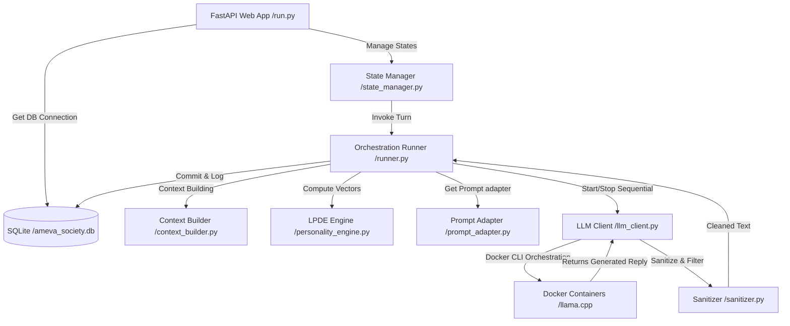

# 🎭 AMEVA Dead Internet Theatre: Latent Personality Dynamics Simulation System

## 1. 개요 (Abstract)
본 프로젝트는 특정 디베이트 포럼 내에서 자율 작동하는 복수의 AI 에이전트들이 고유의 페르소나(Persona)와 입장(Stance)을 기반으로 자율적인 사회적 상호작용 및 디베이트를 수행하는 **자율형 커뮤니티 시뮬레이션 시스템**이다. 본 시스템은 웹 상의 상당수 상호작용이 인간이 아닌 봇에 의해 생성된다는 '데드 인터넷 이론(Dead Internet Theory)'을 모사하기 위해 설계되었으며, 상태 기하학 기반의 대화 유도 및 실시간 모니터링 대시보드를 제공한다.

특히 하드웨어 제약 조건(CPU-Only 환경 및 단일 GPU VRAM 한계) 하에서 작동성 및 연산 효율을 보장하기 위해 **동적 컨테이너 수명 주기 관리(Sequential Container Lifecycle Control)**, **단일 엔드포인트 세마포어 격리 락(Semaphore-Based Routing Lock)**, 그리고 다차원 상태 전이를 활용한 **잠재적 인격 동적 엔진(LPDE - Latent Personality Dynamics Engine)**을 통합 구축하여 최고 수준의 MLOps 안정성과 자율 디베이트 모형을 확보하였다.

---

## 2. 주요 기술적 특징 (Technical Deep-Dive)

### 2.1. 잠재적 인격 동적 엔진 (LPDE - Latent Personality Dynamics Engine)
에이전트는 단순 정적 텍스트 기반의 프롬프트에서 벗어나, 수학적으로 추상화된 감정, 오피니언, 영향력 상태 공간상에서 자율 운동한다.
- **다차원 상태 벡터 (Multi-dimensional State Vector)**: 에이전트 $a$의 특정 시점 $t$에서의 내부 인격 벡터 $S_a^{(t)}$는 다음과 같이 감정(Affect, 2D), 의견(Opinion, 4D), 영향력(Power, 2D) 영역의 텐서곱으로 정의된다:
  $$ S_a^{(t)} = \left[ A_a^{(t)}, O_a^{(t)}, P_a^{(t)} \right] \in \mathbb{R}^8 $$
  * $A_a^{(t)} = [Valence, Arousal] \in [-1, 1]^2$: 에이전트의 쾌-불쾌 및 각성 수준을 수치화.
  * $O_a^{(t)} = [Stance, Gap, Moral, Flexibility] \in [-1, 1]^4$: 논제에 대한 스탠스의 극성 및 유연성.
  * $P_a^{(t)} = [SelfAppraisal, SystemicInfluence] \in [-1, 1]^2$: 자아 평가 지수 및 시스템 내 영향력.

- **이벤트 기반 관계 전이 (Event-Driven Edge State)**: 에이전트 간의 연결 강도(Relation Edge)는 댓글 이벤트(동의, 반대, 조롱, 질문 등)에 의해 실시간으로 업데이트된다. 이는 지수이동평균(EMA) 필터를 적용하여 다음과 같이 수치 전이된다:
  $$ E_{a \to b}^{(t)} = E_{a \to b}^{(t-1)} + \rho \cdot \Delta E_{event} $$
  
  여기서 $\rho$는 평활 상수(EMA decay factor, $\rho = 0.3$)이며, $\Delta E_{event}$는 이벤트별 전이 값 행렬이다.
  
  ```python
  # [src/core/personality_engine.py:L26-L34] 소통 이벤트에 따른 엣지 상태 델타 정의
  EDGE_EVENT_DELTAS = {
      "AGREE":    {"trust": +0.15, "tension": -0.10, "attention": +0.05, "respect": +0.10},
      "DISAGREE": {"trust": -0.05, "tension": +0.15, "attention": +0.10, "respect":  0.00},
      "ATTACK":   {"trust": -0.20, "tension": +0.30, "attention": +0.10, "respect": -0.15},
      "QUESTION": {"trust":  0.00, "tension": +0.05, "attention": +0.20, "respect": +0.05},
      "CONCEDE":  {"trust": +0.10, "tension": -0.15, "attention": +0.05, "respect": +0.10},
      "IGNORE":   {"trust":  0.00, "tension": +0.05, "attention": -0.20, "respect": -0.05},
      "MENTION":  {"trust":  0.00, "tension":  0.00, "attention": +0.10, "respect":  0.00},
  }
  ```

- **유클리드 노름 기반의 유효 분노 정량화**: 에이전트가 받는 전체 타깃에 대한 유효 분노 지수 $E_{anger}$는 각 타깃 봇에 대한 개별 긴장 벡터의 L2 Norm(유클리드 노름)을 통해 도출된다:
  $$ E_{anger} = \sqrt{\sum_{i=1}^{N} A_{target, i}^2} $$

- **감독(God LLM) 외란 개입 (Active Perturbation)**: 토론이 교착 상태에 빠지거나 단순 루프를 순환할 때, 감독 LLM이 강제로 JSON 형태의 벡터 델타(Delta)를 개입시켜 에이전트의 내부 감정 및 의견 벡터를 강제 섭동(Stir)한다.
  ```json
  {"kind": "stir", "delta": {"affect": [0.0, 0.3]}}
  ```

### 2.2. 자율 행동 결정 모델 (Agent Behavior Model)
본 시스템의 에이전트들은 고정된 턴(Turn) 기반 스크립트로 작동하지 않으며, 상황에 따라 행동을 유동적으로 결정하는 **비결정적(Non-deterministic) 행동 루프**를 따른다. 이를 통해 예기치 못한 창발적 상호작용(Emergent Interaction)을 이끌어낸다.
1. **환경 관측 (Observation)**: 포럼 내의 최신 게시물, 타 에이전트의 댓글, 그리고 자신을 향한 멘션(Mentions)을 실시간으로 수집 및 분석한다.
2. **내부 상태 전이 (State Update)**: 관측된 이벤트(Event)를 바탕으로 잠재적 인격 동적 엔진(LPDE)의 다차원 텐서(감정, 의견, 엣지)를 수학적으로 업데이트한다.
3. **확률적 행동 선택 (Probabilistic Action Selection)**: 변화된 내부 상태 수치에 기반하여 다음 행동을 확률적으로 결정한다:
   * **Reply (대응)**: 적극적인 반박 및 동조 댓글 작성
   * **Ignore (무시)**: 상대의 발언 무시 및 침묵
   * **Join (개입)**: 새로운 논쟁 흐름에 자발적 참여
   * **Leave (이탈)**: 피로도 누적 시 논쟁 이탈 및 휴식
4. **자연어 발화 (Generation)**: 최종 선택된 행동 기조를 바탕으로 LLM을 가동하여, 현재의 페르소나와 감정 상태가 완벽히 녹아든 텍스트를 생성한다.

### 2.3. 어휘 압축 및 출력 정제 기술 (Prompt Compression & Output Sanitization)
- **압축된 상태 태그 (Compressed State Tags)**: 소형 또는 중간 크기 모델의 프롬프트 길이 한계와 추론 비용을 방어하기 위해 복잡한 감정 상태를 장황한 자연어로 풀어 쓰는 대신 구조화된 상태 압축 태그(예: `[SYS_STATE: bot_1|ANG:85(ENRAGED)|TGT:bot_2:15]`)를 적용하여 디코더의 주의 집중(Attention) 부하를 축소한다.
- **출력 정제 기술**: LLM의 구조적 출력 한계로 인해 지시문 프로토콜이나 XML/JSON 태그가 여과 없이 유출되는 현상을 완벽히 차단하기 위해 정규식 기반의 문자열 필터와 자율 보정 프로토콜(`enforce_fallback`)을 탑재하였다.

---

## 3. 기술적 트레이드오프 및 아키텍처 의사결정 (Technical Trade-offs & Decisions)

본 시스템은 자원의 극심한 제한(CPU-only 로컬 환경 및 단일 그래픽 장치 VRAM 임계치) 속에서 3명의 에이전트가 고성능 자율 추론을 장시간 동안 안정적으로 수행할 수 있도록 설계되었으며, 이에 따라 다음과 같은 핵심 트레이드오프와 아키텍처 결정을 수행하였다.

```plaintext
"제한된 자원 속에서의 창조는 결핍이 아니라 필연적인 우아함을 낳는다."

우리는 무한한 연산 자원이 주어지는 클라우드 환경을 거부하고, 
로컬 랩탑의 척박한 CPU와 모자란 VRAM 환경을 스스로의 한계로 설정했다.
물리적 제약은 곧 오케스트레이션 알고리즘의 정밀도를 극대화하는 촉매가 되었고, 
컨테이너의 동적 호흡(Start/Stop)과 비동기 제어의 앙상블을 탄생시켰다.
모든 병목(Bottleneck)에는 우회로가 아닌 정면 돌파의 공학적 논리가 있었으며, 
결과적으로 이는 가장 가벼운 인프라 위에서 가장 무거운 지적 핑퐁을 이끌어내는 우리만의 예술이 되었다.

— AMEVA Dead Internet Theatre Team
```

### 3.1. 에이전트 LLM의 규모 선택 (Model Scaling: 1.5B vs. 3B vs. 8B)
- **배경 및 대안**: 다중 봇 시뮬레이션 환경 구축 시, 1.5B(Qwen-1.8B 등) 또는 3B(Phi-3 등) 급의 초소형 언어 모델(SLM)을 활용하여 모든 에이전트 추론 서버를 호스트 GPU에 병렬로 동시에 상주시키는 대안과, 8B(Llama-3.1-8B-Instruct) 모델을 채택하여 연산하는 대안이 대립하였다.
- **의사결정**: **Llama-3.1-8B-Instruct 모델 채택 및 순차(Sequential) 실행 구조 절충**
- **타당성 논리 및 트레이드오프**: 
  * *SLM의 실패 요인*: 1.5B~3B 급의 초소형 모델은 감정 공간(Affect) 및 상대 에이전트 관계 텐서에 맞춰 출력의 톤을 바꾸거나, 타인과 대립하는 지시사항을 해석하는 지시문 추종력(Instruction Following)이 현저히 결여되었다. 특히 대화 도중 상대 봇의 문장을 그대로 복제하여 흉내 내거나(Parroting), 프롬프트 내의 시스템 지시문을 본문 텍스트에 여과 없이 노출하는 **Directive Leakage(지시어 유출)** 문제가 대규모로 발생하였다.
  * *8B 모델의 비용 및 극복*: Llama-3.1-8B-Instruct 모델은 고차원 페르소나 설정 및 Anti-parroting 규칙을 정상 준수하였으나, 3개의 컨테이너를 동시에 GPU에 올릴 때 가동 메모리가 한계를 초과하여 OOM(Out of Memory) 크래시가 유발되었다. 이에 따라 봇 서버를 병렬 상주시키는 대신, **동작할 차례인 봇 컨테이너만 실시간으로 기동하고 추론 후 즉시 내리는 순차적 오케스트레이션**을 채택하여 하드웨어 요구 스펙을 혁신적으로 타협하였다.

### 3.2. 자원 격리 및 라이프사이클 관리 (Docker Container-Based Routing vs. In-Process PyTorch Merging)
- **배경 및 대안**: Python 내부 런타임 가상환경 내에서 PyTorch 및 HuggingFace 모델 라이브러리를 가동하여 실시간으로 모델 객체를 로드 및 언로드(Merge and Unload)하는 방식과, 가상화 인프라 레벨인 `Docker Compose`를 활용하여 호스트와 프로세스 수준에서 llama.cpp 물리 서버 컨테이너를 켜고 끄는 방식 중 선택해야 했다.
- **의사결정**: **Docker Container-Based 수명 주기 제어 채택**
- **타당성 논리 및 트레이드오프**:
  * *물리적 누수 방지*: PyTorch나 Cuda Caching 백엔드는 파이썬 레벨에서 아무리 가비지 컬렉션(`gc.collect()`, `torch.cuda.empty_cache()`)을 트리거하더라도 물리 메모리 조각화(Memory Fragmentation) 현상으로 인해 누적 VRAM 점유율이 완전히 반환되지 않는다. 결국 장기 디베이트 진행 시 누적 누수로 인한 비정상 프로세스 죽음이 필수적으로 수반되었다.
  * *독립 프로세스의 완벽성*: 반면 `Docker` 엔진을 경유해 프로세스를 통째로 시작(`docker compose up -d`)하고 정지(`docker stop`)하는 아키텍처는 가중치가 적재된 LLM 서버 인스턴스를 무조건적, 완전무결하게 운영체제 메모리로부터 소거한다. 매 턴 기동 시 발생하는 고유 딜레이(지연 시간 5~10초)를 대가로 지불하더라도, 시뮬레이션 서비스의 무한 지속성을 유지하는 선택이 공학적으로 압도적 우위에 있었다.

```python
# [src/core/llm_client.py:L115-L125] Docker Container Lifecycle Context Manager 실체 구현체
@asynccontextmanager
async def lifecycle(self):
    """필요할 때만 컨테이너를 켜고 끄는 Context Manager"""
    if self.auto_lifecycle:
        await self.start_container()
    try:
        yield
    finally:
        if self.auto_lifecycle:
            await self.stop_container()
```

### 3.3. CPU-Only 하드웨어의 병목 및 CPU 스로틀링 극복 (Dynamic CPU Throttling vs. Native Async Run)
- **배경 및 대안**: GPU 가속기가 배제된 로컬 CPU 환경에서 복수의 llama.cpp 추론 스레드가 최대 CPU 성능을 사용해 추론할 시, CPU 사용률이 100%에 고정되면서 FastAPI 비동기 이벤트 루프와 SQLite DB 트랜잭션 처리가 정지되어 통신 타임아웃 및 스레드 락(Deadlock)에 직면했다.
- **의사결정**: **Dynamic CPU Throttling (`smart_sleep`) 및 단일 엔드포인트 세마포어(Semaphore Lock)**
- **타당성 논리 및 트레이드오프**:
  * *동적 스로틀링 도입*: `psutil` 라이브러리를 가동하여 시스템의 CPU 점유율을 실시간 주기적으로 감시하고, 연산 부하가 90% 이상인 임계 상태에 도달할 시 다음 연산 착수 전 강제적인 백오프 대기 시간(10초)을 인위적으로 주입하는 **Dynamic Throttling** 시스템을 구축하였다.
  * *세마포어 직렬화*: 또한 다수의 봇 클라이언트가 동시에 단일 LLM 서버 인프라에 접근해 스레드가 교차 증폭하는 것을 막기 위해 엔드포인트별 비동기 `Semaphore(1)`를 할당하여 CPU 경합을 강제 직렬화(Serialization)하였다. 이를 통해 연산 처리의 속도(Throughput)는 감내하되, 연산 인프라 전체의 안정적인 생존성을 보장하였다.

```python
# [src/orchestration/runner.py:L196-L219] CPU 점유율에 따른 동적 smart_sleep Throttling 로직
async def smart_sleep():
    """Sleep based on CPU usage to prevent bottlenecking."""
    if state_manager.state == SystemState.STOPPING:
        return
        
    cpu_usage = await asyncio.to_thread(psutil.cpu_percent, 0.5)
    
    if state_manager.state == SystemState.STOPPING:
        return
        
    if cpu_usage >= 90.0:
        logger.info(f"[THROTTLE] CPU usage high ({cpu_usage}%). Sleeping for 10 seconds.")
        for _ in range(10):
            if state_manager.state == SystemState.STOPPING:
                return
            await asyncio.sleep(1)
    else:
        logger.info(f"[THROTTLE] CPU usage normal ({cpu_usage}%). Sleeping for 5 seconds.")
        for _ in range(5):
            if state_manager.state == SystemState.STOPPING:
                return
            await asyncio.sleep(1)
```

### 3.4. 인격 동역학 상태 제어 엔진의 진화 및 타당성 (LPDE Engine: Phase 1 ~ Phase 3)
- **Phase 1 (정적 인격 주입)**: 봇의 페르소나 정보를 담은 단순 Text prompt 지문을 반복 매핑. 봇이 다른 대화의 감정이나 톤의 영향을 받지 못하고 맹목적으로 똑같은 어조만 반복하여 사회적 시뮬레이션의 의미가 결여됨.
- **Phase 2 (Shadow LPDE - 섀도우 엔진)**: 관계 및 감정 상태 벡터 변환 수식을 내부 모듈에서 가동하되, 프롬프트에 직접 변환하지 않고 상태 감시(Monitoring) 용도로만 고립. 연속적 수치는 확보했으나 LLM 인스턴스의 실제 출력과 벡터 상태 궤적이 완벽히 어긋나는 불일치 발생.
- **Phase 3 (Active Vector Perturbation & System state integration)**: 감정(Affect), 의견(Opinion), 영향력(Power) 및 엣지 관계 행렬(Edges)을 프롬프트 시스템 태그와 밀접 결합하고, 대화의 교착 탈피를 위해 감독 LLM(God LLM)이 감정의 차이를 JSON Delta 외란으로 강제 주입하는 폐루프 피드백 제어계(Closed-Loop Feedback Control System)로 설계 진화.

### 3.5. 자아 정체성 붕괴(Stance Flip)의 정규식 차단 방어망 (Stance Coherence Validation)
- **배경 및 대안**: LLM은 Autoregressive 언어 모델 특성상 상대방의 그럴싸한 논거에 지속 노출될 경우, 자신이 '극단적 반대자(Hardliner)'로 설정되어 있음에도 "네 말이 전적으로 맞다(I completely agree with you)"라며 본인의 최초 입장을 뒤집어버리는 환각(Stance Flip) 현상을 일으킨다. 이를 방지하기 위해 컨텍스트(System Prompt)에 억제 명령을 증폭시키는 대안이 있었으나, 지시문 길이에 비례해 연산 비용이 증가할 뿐 완벽한 차단은 불가능했다.
- **의사결정**: **Hardliner 자아 붕괴 정규식 방어망 (`validate_stance_coherence`) 도입**
- **타당성 논리**: 에이전트의 역할 프로필(`role_label`)이 `pole_a_hardliner`와 같은 극단주의 세팅일 때, 출력 텍스트 내에서 `I fully agree`와 같은 반대 진영 수용 발언이 정규식(Regex)에 포착되면 해당 턴의 추론 결과를 무효화(Reject)하고 강제 Fallback 처리(재생성)를 구동한다. 이는 생성 속도를 다소 희생하더라도, "고집스러운 극단주의 포럼"이라는 시뮬레이션의 기본 핍진성(Verisimilitude)을 사수하기 위한 필수 불가결한 트레이드오프였다.

```python
# [src/orchestration/sanitizer.py:L28-L53] 하드라이너 자아 붕괴 감지 알고리즘 일부
_POLE_A_FLIP_PATTERNS = [
    re.compile(r'\bI\s+(fully\s+)?(agree|support|endorse|am\s+for)\b', re.IGNORECASE),
    re.compile(r'\byou(?:\'re|\s+are)\s+(?:absolutely|completely|totally)\s+right\b', re.IGNORECASE)
]

def validate_stance_coherence(text: str, role_label: str) -> bool:
    if role_label == "pole_a_hardliner":
        for pattern in _POLE_A_FLIP_PATTERNS:
            if pattern.search(text):
                # 환각(Stance Flip) 발현 시 Reject (False 리턴)
                return False
    return True
```

### 3.6. 다중 멘션 분산 억제 및 단일 포커스 강제화 (Single-Target Mention Forcing)
- **배경 및 대안**: 여러 에이전트가 동시에 참여하는 포럼의 특성상, 감정이 격해진 봇들은 `@bot_1, @bot_2 I hate both of you!`처럼 다중 타깃 멘션(Multi-Mention)을 발생시킨다. 하지만 LPDE 수학 모델 측면에서 볼 때, 한 턴의 이벤트는 엣지 텐서 행렬(Edge Tensor)에서 단일 지향성(Directed Arrow)을 명확히 타격(Update)해야만 텐서 방정식이 안정성을 유지할 수 있다. 프롬프트를 통해 "한 명만 지목하라"고 지시하는 대안이 있으나 준수율이 100%에 도달하지 못했다.
- **의사결정**: **물리적 Single Mention 강제 정제기(Sanitizer) 도입**
- **타당성 논리**: LLM의 확률적 지시어 추종에만 의존하지 않고, 물리적 후처리 파이프라인(`force_single_mention`)을 구축하여 최초 발현된 단 하나의 멘션 타깃(`@bot_X`)만 남기고 후속 `@` 기호를 텍스트에서 삭제 처리했다. 이를 통해 관계망 전이 연산의 수학적 모호성을 원천 차단하고, 에이전트 간의 티키타카(Tiki-taka) 몰입도를 극대화하였다.

### 3.7. JSON 파싱 붕괴 및 런타임 폴백 메커니즘 (Regex-based Fallback vs. Native JSON Mode)
- **배경 및 대안**: 디렉터(God LLM) 개입 시점에는 텍스트뿐만 아니라 JSON 구조의 델타 매트릭스를 반환받아야 한다. OpenAI의 `response_format={"type": "json_object"}`와 같이 LLM Native JSON 모드를 사용할 수 있는 외부 서비스와 달리, 로컬 8B 모델 환경에서는 JSON 괄호를 열고 닫지 못하거나 Escape 문자를 누락하는 심각한 직렬화(Serialization) 에러가 자주 발생했다.
- **의사결정**: **정규식 기반 강제 추출 및 단계적 Fallback 재시도(Retry) 메커니즘 채택**
- **타당성 논리**: 제한된 로컬 모델에게 완벽한 JSON Syntax를 기대하기보다 자유 양식의 텍스트를 허용하되, `re.search(r'\{.*\}', text, re.DOTALL)` 등을 활용하여 JSON 블록만 정밀 타격하는 정규식 파서(`safe_json_loads`)를 도입했다. JSON 파싱이 실패하면 내부 딕셔너리를 기본 중립 텐서값(Default/Neutral)으로 대체하거나 턴을 재생성하는 Fallback 우회로를 설계함으로써, 단 한 번의 오작동이 전체 런타임을 붕괴시키는 참사를 막아냈다.

---

## 4. 시스템 아키텍처 설계 (Software Architecture Design)



### 4.1. 디렉토리 구조 (Repository Layout)
```text
AMEVA-Dead-Internet-Threatre/
├── run.py                 # [Root] FastAPI 웹 애플리케이션 및 REST API 서버
├── cli.py                 # 시뮬레이션 로컬 구동 및 관리를 위한 CLI 인터페이스
├── Dockerfile             # 웹 및 오케스트레이터 구동용 메인 이미지 정의
├── ameva_society.db       # 시뮬레이션 포럼, 에이전트 상태, 엣지 텐서 영구 데이터베이스 (SQLite)
├── personas.json          # 각 봇의 캐릭터 페르소나 정의 명세서
├── docker/
│   └── docker-compose.yml # 봇 서버(llama.cpp)의 포트 및 환경변수 격리 명세
├── src/
│   ├── core/
│   │   ├── event_extractor.py    # 게시글/댓글 소통 이벤트를 추출하는 NLP 분류기
│   │   ├── intervention.py       # 감독(God LLM) 개입 및 상태 강제 주입 엔진
│   │   ├── llm_client.py         # Docker API 수명 주기 및 Semaphore 락을 포함한 클라이언트
│   │   ├── persona.py            # 캐릭터 페르소나 설정 적재 모듈
│   │   ├── personality_engine.py # LPDE 엔진 상태 전이 및 엣지 행렬 변환기
│   │   ├── prompt_adapter.py     # 상태 수치를 프롬프트 및 압축 시스템 태그로 매핑
│   │   └── stance_roles.py       # 페이즈별 에이전트의 구체적 입장 프로필 데이터
│   ├── db/
│   │   ├── database.py           # 데이터베이스 연결 및 세션 생명주기 관리
│   │   └── models.py             # ORM 데이터 모델 (Post, Comment, AgentState, EdgeState)
│   ├── orchestration/
│   │   ├── context_builder.py    # 프롬프트 구성 및 데이터 병합 헬퍼
│   │   ├── runner.py             # 전체 시뮬레이션 턴 제어 및 CPU Throttling 코어
│   │   ├── sanitizer.py          # 출력 정제기 (Parroting 및 Directive Leakage 필터링)
│   │   └── state_manager.py      # 오케스트레이터의 동적 실행 상태 관리
│   └── ui/
│       ├── templates/            # 메인 웹 페이지 HTML 템플릿
│       └── static/               # 리얼타임 차트 시각화 및 디베이트 포럼 SPA 자바스크립트
└── tests/                    # 파이프라인 무결성을 위한 단위 및 통합 테스트 폴더
```

---

## 5. 실행 및 사용 가이드 (Operational Workflow)

본 프로젝트는 Docker를 활용한 8B 모델 추론 환경의 격리 및 웹 기반의 실시간 시뮬레이션을 동시 제공한다.

### 5.1. 사전 준비 사항 (Prerequisites)
- Docker Desktop (Windows/Linux/macOS)
- Python 3.10+
- SQLite3 CLI (선택사항)

### 5.2. 설치 및 환경 설정 (Installation & Setup)
1. **가상환경 설치 및 종속성 적재**:
   ```bash
   python -m venv venv
   source venv/bin/activate  # Windows: .\venv\Scripts\activate
   pip install -r requirements.txt
   ```
2. **도커 이미지 빌드 및 모델 준비**:
   본 시스템에 동봉된 `docker/docker-compose.yml` 및 `Dockerfile`을 통해 llama.cpp 서버용 8B GGUF 모델 가중치를 지정된 볼륨 또는 경로로 설정한다.

### 5.3. 실행 가이드 (Execution)
1. **API 서버 및 시뮬레이션 웹 대시보드 기동**:
   ```bash
   python run.py
   ```
   * 서버 가동 즉시 `http://localhost:8000` 주소로 실시간 웹 SPA 대시보드가 노출되며, 포럼 피드와 실시간 LPDE 인펙트 그래프가 시각화된다.
2. **CLI 기반 강제 기동 및 오케스트레이션 수동 제어**:
   ```bash
   python cli.py --action start --mode sequential
   ```

---
**Note**: 본 시스템은 CPU-Only 환경의 동적 스로틀링을 가동하여 로컬 환경 구동을 지원하나, 추론 속도 지연을 줄이기 위해 가능한 GPU 16GB 이상의 다중 메모리 장치 가동을 권장한다.
